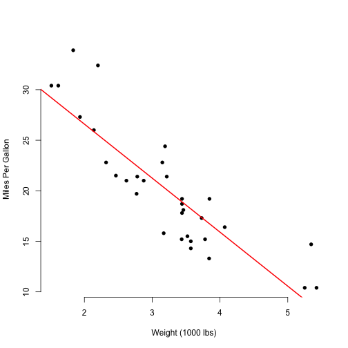
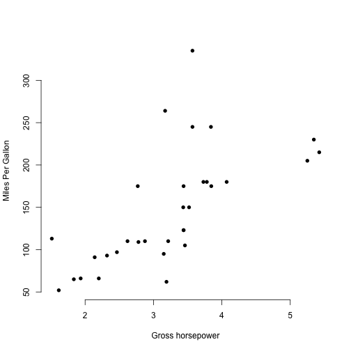

## What we did?

We created an app that selects a new predictor and the plot will update the axis
with the selected predictor a new regression will be calculated and ploted, and 
at the end the most important values of the regression will be display.

--- .class #id 

## Basic example
Imagine we select *Weight (1000 lbs)*



--- .class #id 

## Regressions Coefficients
Then we show the coefficients at the bottom


```r
print(paste("R Squared:", round(summary(modelFit)$r.squared, 3)))
```

```
## [1] "R Squared: 0.753"
```

```r
print(paste("Intercept:",  round(modelFit$coefficients[1],3)))
```

```
## [1] "Intercept: 37.285"
```

```r
print(paste("Slope:",  round(modelFit$coefficients[2],3)))
```

```
## [1] "Slope: -5.344"
```

--- .class #id 

## Change predictor
Then we change the predictor and a new plot and coefficients appear, thats it!



